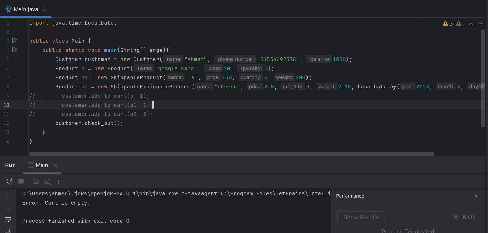
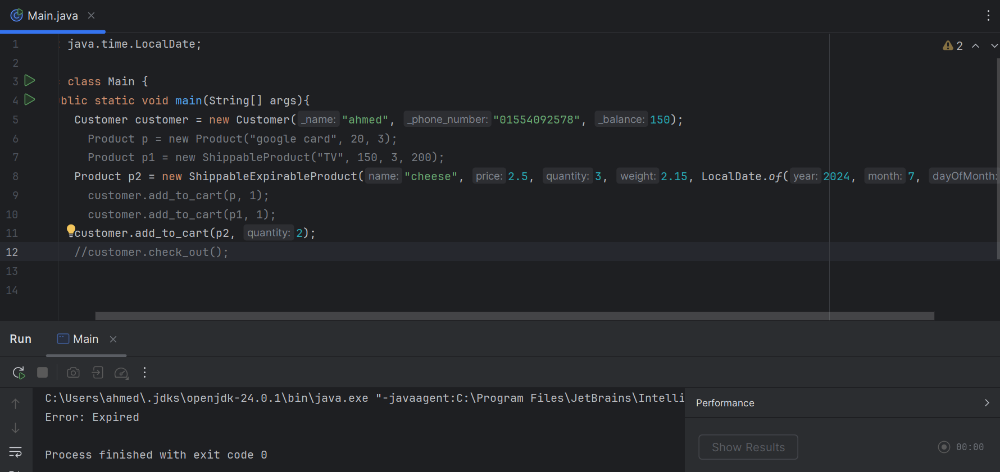
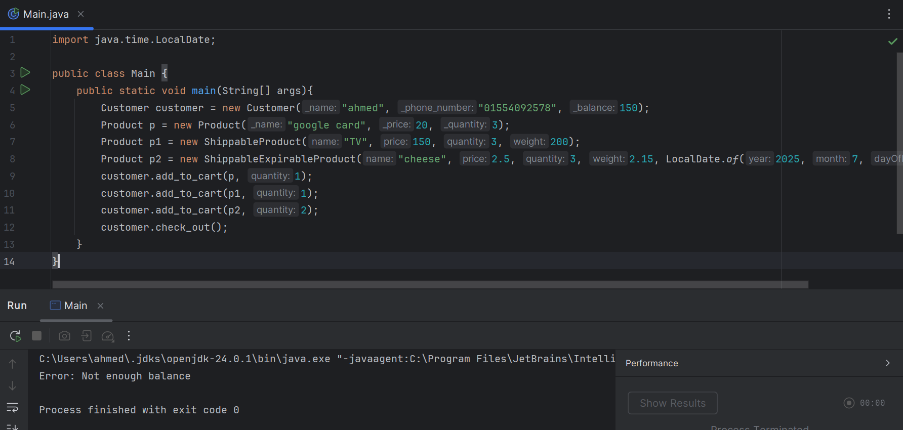
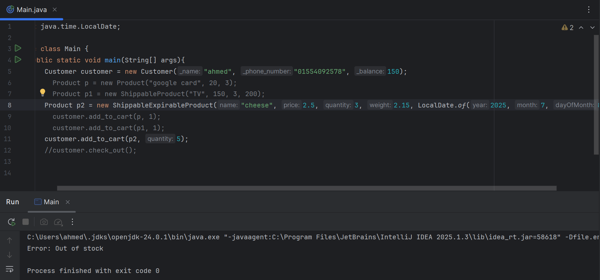
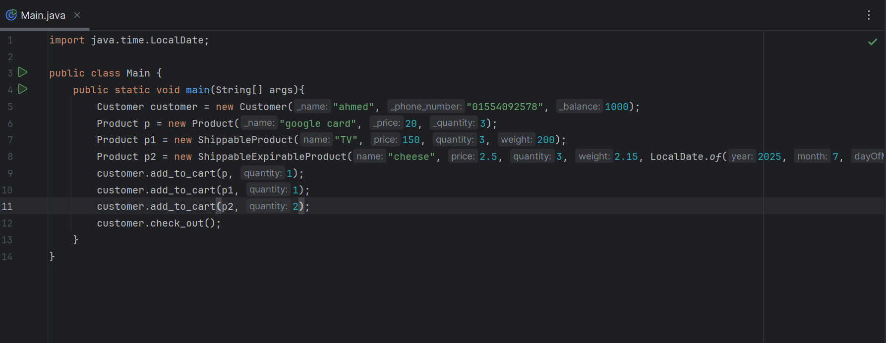

# 🛒 Fawry challenge

This is a simple Java-based e-commerce application. It models different types of products (perishable, weighted, etc.) using interfaces and object-oriented design. Products that can be shipped implement a common `Shippable` interface, and are collected and sent to a `ShippingService`.

---

## 📦 Features

- Common `Product` base class with `name`, `price`, and `quantity`
- Specialized product types:
    - `ShippableExpirableProduct` (has an expiry date, is shippable)
    - `ShippableProduct` (has weight, is shippable)
- Interface-driven design:
    - `Expirable` and `Shippable`
- `ShippingService` accepts only items implementing `Shippable`
- Simple main program simulates adding products to a cart and shipping them

---
## Tests
- When a customer checks out an empty cart.

- When a customer tries to buy an expired product (expire date is 2024).

- No enough balance. (balance is 150)

- Product out of stock (tried to buy 5 but quantity is 3)

- Finally, full good test

